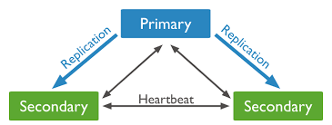

## MongoDB

#### What is MongoDB

MongoDB is a NoSql database that doesnt rely on structured schemas but more on json like documents and is well suited to be horizontally scalable 

#### What are Collections and Documents

- A document is the basic unit of data in mongodb and is like a row of data in most other formats.
- A collection is a group of related documents. The equivalent to a table in SQL

#### MongoDB Architecture

- Client

- Mongod

- Mongos

- Replica Sets

- Shards

#### What are Replica Sets
A replica set is a group of mongodb servers that maintain the same data set. 
This provides a measure of security if one where to fail and makes it much easier for lots of people to access the data.

##### How do they work?
- One primary server handles all the inserts/updates/deletions
- The secondaries replicate the data and or changes from the primary, constantly copying from that server.
- Read requests can be preformed on both the secondary and primary servers
- If the primary server fails, the secondary servers automaticly elect one to become the new primary.
- New clients will automaticly connect to the new primary server.

