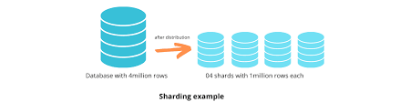

## MongoDB

#### What is MongoDB

MongoDB is a NoSql database that doesnt rely on structured schemas but more on json like documents and is well suited to be horizontally scalable 

#### What are Collections and Documents

- A document is the basic unit of data in mongodb and is like a row of data in most other formats.
- A collection is a group of related documents. The equivalent to a table in SQL

#### MongoDB Architecture

- Client

- Mongod

- Mongos

- Replica Sets

- Shards

#### What are Replica Sets
A replica set is a group of mongodb servers that maintain the same data set. 
This provides a measure of security if one where to fail and makes it much easier for lots of people to access the data.

##### How do they work?
- One primary server handles all the inserts/updates/deletions
- The secondaries replicate the data and or changes from the primary, constantly copying from that server.
- Read requests can be preformed on both the secondary and primary servers
- If the primary server fails, the secondary servers automaticly elect one to become the new primary.
- New clients will automaticly connect to the new primary server.

##### Advantages

- The data is almost always available.
- In the event of failure the data remains available and proctected via redundancy

##### Disadvantaged
- Increased storage needed
- Complex to set up in a large deployments
- A slight delay between primary and secondary servers

#### What is Sharding
Sharding in the process of splitting data across multiple servers in order to support large datasets.

##### How does it work?
- Each shard contains a subset of the data.
- Config servers store meta data and rounting information
- Mongos router directs queries to correct shard or shards
- Shard keys determine how the data is split.

##### Advantages
- Capable of handling huge datasets
- Increased read/write capacity
- Capable of horizontal scaling
##### Disadvantages
- Complex architecture
- Hard to manage and maintain backups
#### Use Cases
##### Ebay
- MongoDB is used to give real time analytics of large volumes of user data.
- They chose MongoDB specifically to for its flexible schema and high write throughput.
##### EA Games
- They collect real time game telemtry for balancing and analysis.
- MongoDB is used to store large volumes of event logs with different loose schema.
- This allows for quicker and more efficent querying to make live dashboards for game statistics.